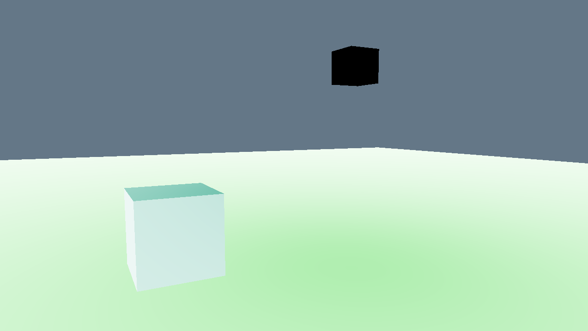

# Post processing effects in OpenGL
## Controls:
1 - Invert
 
2 - Blur
 
3 - Gaussian blur
 
Press the same button to undo effect
### Framebuffer:
 
 

## Effects:
### Invert (1):

 
### Blur (2):

 
### Gaussian blur (3):

